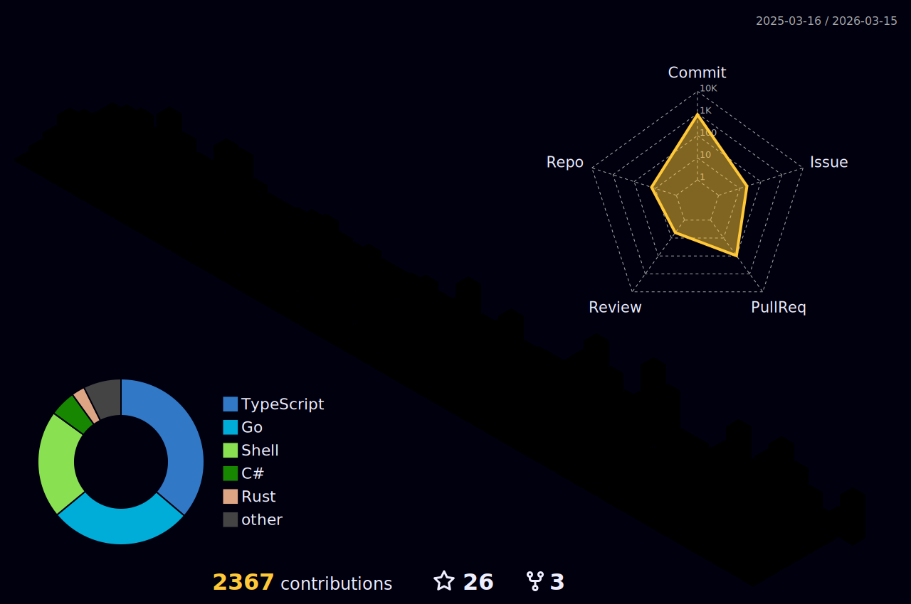

### Skills

  

  <a href="https://yashikota.com/about" alt="more information">
    More information
  </a>

### Works

- [FunBook](https://funbook.pages.dev)
- [JANcode Generator](https://github.com/yashikota/jancode)
- [TD4 Emulator](https://github.com/yashikota/td4-py)
- [OIT Syllabus App](https://github.com/oit-tools/syllabus-frontend)
- [OIT Syllabus Scraping](https://github.com/oit-tools/syllabus-scraping)

and more

  <a href="https://yashikota.com/projects" alt="more information">
    More information
  </a>

### Contributions

<table align="center">
  <tr>
    <td>
      
    </td>
    <td align="center">
      
      
    </td>
  </tr>
</table>
