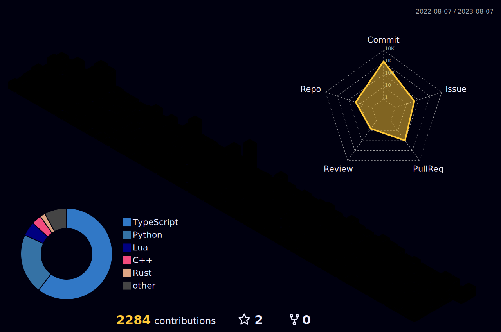

### Skills

  

  <a href="https://yashikota.com/about" alt="more information">
    More information
  </a>

### Works

- [OIT Syllabus App](https://github.com/oit-tools/syllabus-frontend)
- [OIT Syllabus Scraping](https://github.com/oit-tools/syllabus-scraping)
- [OIT Syllabus API](https://github.com/oit-tools/syllabus-api-deno)
- [AtCoder Beginner Contest Latest API](https://github.com/yashikota/abc-latest-api)
- [AtCoder Beginner Contest Notification Bot](https://github.com/yashikota/abc-latest-bot)
- [JANcode Generator](https://github.com/yashikota/jancode)
- [Pomodoro Timer](https://github.com/yashikota/pomodoro-timer)
- [YOLOv5 Auto Annotation Tool](https://github.com/yashikota/auto-annotation)
- [Minecraft Server Notification Bot](https://github.com/yashikota/minecraft-server-bot)
- [Aozora Markov Bot](https://github.com/yashikota/aozora-markov)

and more

  <a href="https://yashikota.com/projects" alt="more information">
    More information
  </a>

### Contributions

<table align="center">
  <tr>
    <td>
      
    </td>
    <td align="center">
      
      
    </td>
  </tr>
</table>
